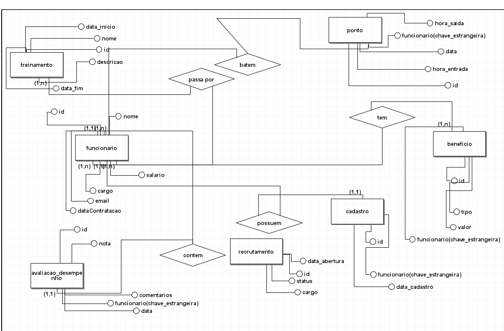

# Escopo do Projeto: Sistema de Gestão de Recursos Humanos (RH)

## Objetivo do Projeto

Desenvolver um sistema de gestão de RH que permitirá às empresas gerenciar seus processos relacionados a funcionários de forma eficiente e automatizada. O sistema ajudará na administração de registros de funcionários, controle de ponto, gerenciamento de benefícios, processos de recrutamento, treinamentos, e avaliação de desempenho.

## Objetivos Específicos

1. **Automatizar o processo de cadastro e gerenciamento de funcionários**  
   Desenvolver funcionalidades que permitam ao setor de RH cadastrar, consultar, atualizar e excluir informações de funcionários de maneira eficiente, mantendo um histórico de alterações.

2. **Implementar um sistema de controle de ponto eletrônico**  
   Criar uma ferramenta que registre automaticamente o horário de entrada, saída e intervalos dos funcionários, com relatórios que possam ser gerados para análise de horas trabalhadas e horas extras.

3. **Desenvolver um módulo para a gestão de recrutamento e seleção**  
   Criar um sistema que permita ao RH gerenciar as etapas do recrutamento, desde a publicação de vagas até o registro de candidatos, acompanhamento de entrevistas e seleção final, otimizando o processo de contratação.

4. **Gerenciar benefícios e facilitar o acesso dos funcionários a informações**  
   Implementar uma plataforma que permita o controle dos benefícios oferecidos aos funcionários, como plano de saúde, vale-transporte e alimentação, com uma interface para que os próprios funcionários possam consultar e solicitar ajustes nos benefícios.

5. **Criar um sistema de treinamento e desenvolvimento de competências**  
   Permitir que o RH cadastre e organize cursos e treinamentos oferecidos pela empresa, associando-os aos funcionários, e registre a conclusão e avaliação desses treinamentos.

6. **Desenvolver um módulo de avaliação de desempenho**  
   Criar um sistema de avaliação periódica de funcionários, permitindo que supervisores e gestores registrem feedbacks, notas de desempenho e gerem relatórios individuais para acompanhamento do desenvolvimento dos funcionários.

7. **Fornecer relatórios detalhados e painéis de controle personalizados**  
   Implementar ferramentas que gerem relatórios automáticos sobre a força de trabalho da empresa, como turn-over, horas trabalhadas, desempenho e métricas de recrutamento, permitindo a criação de dashboards customizados para fácil visualização.

8. **Garantir a segurança e confidencialidade dos dados de funcionários**  
   Implementar mecanismos robustos de segurança, como autenticação baseada em tokens JWT, criptografia de dados sensíveis e níveis de acesso diferenciados para assegurar que apenas usuários autorizados possam acessar informações confidenciais.

9. **Permitir a integração com sistemas de folha de pagamento e outros sistemas corporativos**  
   Desenvolver APIs ou mecanismos de exportação de dados que facilitem a integração do sistema de RH com outros sistemas utilizados pela empresa, como sistemas de folha de pagamento ou ERPs.

## Objetivos Mensuráveis

1. **Automatizar o cadastro de funcionários**  
   - **Meta:** Reduzir o tempo necessário para o cadastro de novos funcionários em 50%, passando de 30 minutos para 15 minutos por funcionário até o final do projeto.  
   - **Métrica:** Tempo médio para completar um cadastro de funcionário.

2. **Implementar o controle de ponto eletrônico**  
   - **Meta:** Atingir 95% de precisão nos registros de ponto dos funcionários até o final do segundo mês após a implementação.  
   - **Métrica:** Porcentagem de registros corretos de ponto eletrônico comparada ao manual.

3. **Reduzir o tempo do processo de recrutamento e seleção**  
   - **Meta:** Diminuir o tempo total do processo de recrutamento, do anúncio da vaga até a contratação, de 60 dias para 40 dias dentro de 3 meses após a implantação do sistema.  
   - **Métrica:** Tempo médio do ciclo de recrutamento (anúncio da vaga até a contratação).

4. **Facilitar o gerenciamento de benefícios para funcionários**  
   - **Meta:** Aumentar em 80% o número de solicitações de benefícios realizadas diretamente pelo portal pelos funcionários em vez de via RH.  
   - **Métrica:** Número de solicitações de benefícios feitas pelo sistema versus pelo RH.

5. **Aumentar a adesão aos treinamentos**  
   - **Meta:** Aumentar em 30% a participação dos funcionários em cursos de treinamento em 6 meses após o lançamento do módulo de treinamento.  
   - **Métrica:** Taxa de participação nos treinamentos antes e depois da implementação.

6. **Aprimorar o processo de avaliação de desempenho**  
   - **Meta:** Garantir que 100% dos funcionários recebam avaliações de desempenho regulares a cada 6 meses, com 90% de participação nos feedbacks registrados pelos gestores até o fim do primeiro ano de uso do sistema.  
   - **Métrica:** Percentual de funcionários que receberam avaliações e feedbacks no prazo.

7. **Fornecer relatórios detalhados e dashboards personalizados**  
   - **Meta:** Oferecer 10 tipos de relatórios diferentes (relacionados a funcionários, turn-over, horas extras, etc.) até o final do projeto, com a possibilidade de personalizar pelo menos 5 deles.  
   - **Métrica:** Número de relatórios disponíveis e relatórios personalizados gerados pelo sistema.

8. **Garantir a segurança de dados dos funcionários**  
   - **Meta:** Implementar controles de segurança que reduzam incidentes relacionados à exposição ou vazamento de dados para 0% até o final do desenvolvimento.  
   - **Métrica:** Número de incidentes de segurança reportados.

9. **Melhorar a produtividade do RH**  
   - **Meta:** Aumentar a eficiência do departamento de RH em 30%, permitindo que o número de tarefas manuais diminua e o foco seja em atividades estratégicas.  
   - **Métrica:** Redução do tempo gasto em atividades administrativas e manuais pelo RH.
  
   - ## Objetivos Atingíveis

1. **Automatizar o cadastro de funcionários**  
   - **Descrição:** O processo de digitalização do cadastro de funcionários pode ser atingido de forma gradual, iniciando pela migração dos registros manuais para o sistema e, em seguida, automatizando os fluxos de cadastro. Com a equipe de desenvolvimento e as ferramentas adequadas, é possível atingir essa meta em até 2 meses.  
   - **Recursos:** Equipe de desenvolvimento, software de gerenciamento de banco de dados, integração com sistemas existentes.

2. **Implementar o controle de ponto eletrônico**  
   - **Descrição:** A implementação do sistema de controle de ponto eletrônico é uma tarefa viável, utilizando APIs de integração com relógios de ponto ou softwares já existentes. A configuração pode ser concluída dentro de um cronograma de 3 semanas, incluindo testes.  
   - **Recursos:** APIs ou dispositivos de ponto eletrônico, infraestrutura de TI.

3. **Reduzir o tempo do processo de recrutamento e seleção**  
   - **Descrição:** Com a digitalização do processo de recrutamento e a automatização de etapas como a triagem de currículos e agendamento de entrevistas, a meta de reduzir o tempo de contratação em 33% é atingível com o uso de um módulo específico de recrutamento dentro do sistema.  
   - **Recursos:** Equipe de desenvolvimento, ferramentas de triagem de currículos e automação de e-mails.

4. **Facilitar o gerenciamento de benefícios para funcionários**  
   - **Descrição:** A criação de um portal para que os próprios funcionários possam consultar e solicitar benefícios é um objetivo viável, especialmente se o sistema for integrado com os provedores de benefícios. Com uma equipe de desenvolvimento dedicada, essa funcionalidade pode ser implementada dentro de 3 semanas.  
   - **Recursos:** Integração com provedores de benefícios, plataforma web ou mobile.

5. **Aumentar a adesão aos treinamentos**  
   - **Descrição:** Oferecer uma interface fácil de usar para que os funcionários se inscrevam em treinamentos e acompanhar seus progressos é um objetivo alcançável. A meta de aumentar a participação pode ser atingida com incentivos internos e lembretes automáticos, além de gamificação.  
   - **Recursos:** Equipe de TI para desenvolvimento do módulo, equipe de RH para organizar os treinamentos.

6. **Aprimorar o processo de avaliação de desempenho**  
   - **Descrição:** O desenvolvimento de um sistema que permita avaliações periódicas, com feedback automatizado e fácil para gestores e funcionários, é possível em 4 semanas. O sistema pode incluir métricas personalizadas e relatórios para otimizar o processo.  
   - **Recursos:** Banco de dados de avaliação de desempenho, plataforma de relatórios.

7. **Fornecer relatórios detalhados e dashboards personalizados**  
   - **Descrição:** Criar relatórios e dashboards customizados que atendam às necessidades do RH é uma tarefa factível, utilizando ferramentas de visualização de dados. Relatórios automáticos podem ser desenvolvidos dentro de 2 semanas após a coleta de dados suficientes.  
   - **Recursos:** Ferramentas de visualização de dados, equipe de desenvolvimento.

8. **Garantir a segurança de dados dos funcionários**  
   - **Descrição:** A implementação de boas práticas de segurança, como criptografia e controle de acesso, é uma meta atingível ao longo do desenvolvimento. Com as ferramentas certas, a equipe pode configurar esses mecanismos e realizar auditorias de segurança dentro do cronograma.  
   - **Recursos:** Ferramentas de segurança de dados, expertise em segurança da informação.

9. **Melhorar a produtividade do RH**  
   - **Descrição:** Automatizando tarefas repetitivas e utilizando relatórios detalhados para a tomada de decisão, é possível aumentar a produtividade em 30% em um prazo de 6 meses. A equipe de RH poderá focar em atividades estratégicas.  
   - **Recursos:** Ferramentas de automação, treinamento da equipe para uso do novo sistema.

## Objetivos Relevantes

1. **Automatizar o cadastro de funcionários**  
   - **Relevância:** A automação do cadastro de funcionários melhora a eficiência do departamento de RH, reduzindo o tempo gasto em tarefas manuais e minimizando erros humanos. Isso permite que o RH se concentre em atividades mais estratégicas, como desenvolvimento de talentos e retenção.  
   - **Impacto:** A empresa ganha agilidade na gestão de novos funcionários e na atualização de dados, tornando o processo de onboarding mais rápido e eficiente.

2. **Implementar o controle de ponto eletrônico**  
   - **Relevância:** Um sistema de controle de ponto eletrônico garante que a empresa esteja em conformidade com as leis trabalhistas e facilita a gestão das horas trabalhadas, horas extras e atrasos, reduzindo possíveis conflitos entre funcionários e empresa.  
   - **Impacto:** A empresa melhora a precisão na gestão de horas trabalhadas e reduz o tempo gasto na conferência manual de ponto, além de aumentar a transparência para os funcionários.

3. **Reduzir o tempo do processo de recrutamento e seleção**  
   - **Relevância:** Um processo de recrutamento mais rápido e eficiente ajuda a empresa a preencher vagas críticas com mais agilidade, evitando a perda de talentos no mercado e garantindo que as equipes estejam sempre completas.  
   - **Impacto:** Reduz a lacuna de tempo em posições-chave e melhora a competitividade da empresa no mercado de trabalho, permitindo atrair e contratar os melhores candidatos rapidamente.

4. **Facilitar o gerenciamento de benefícios para funcionários**  
   - **Relevância:** Permitir que os funcionários acessem e gerenciem seus benefícios de maneira autônoma melhora a satisfação e a experiência do funcionário, além de aliviar o RH de questões repetitivas relacionadas aos benefícios.  
   - **Impacto:** A empresa aumenta a transparência e o engajamento dos funcionários, além de otimizar os processos do RH.

5. **Aumentar a adesão aos treinamentos**  
   - **Relevância:** Treinamentos são essenciais para o desenvolvimento contínuo dos funcionários e, consequentemente, para o crescimento da empresa. Aumentar a adesão a programas de capacitação resulta em uma equipe mais qualificada e engajada.  
   - **Impacto:** A empresa terá uma força de trabalho mais bem preparada para lidar com novos desafios, melhorando a produtividade e a inovação.

6. **Aprimorar o processo de avaliação de desempenho**  
   - **Relevância:** Avaliações regulares e estruturadas permitem que a empresa identifique talentos, avalie o progresso dos funcionários e implemente planos de desenvolvimento. Isso é essencial para retenção de talentos e crescimento organizacional.  
   - **Impacto:** A empresa se beneficia de um RH mais estratégico, que utiliza avaliações de desempenho para melhorar o engajamento dos funcionários e alinhar as expectativas de desempenho com os objetivos organizacionais.

7. **Fornecer relatórios detalhados e dashboards personalizados**  
   - **Relevância:** Dashboards e relatórios detalhados oferecem uma visão clara do desempenho da força de trabalho, permitindo que o RH e a alta gestão tomem decisões baseadas em dados. Isso é crucial para uma gestão mais eficaz e informada.  
   - **Impacto:** A empresa se torna mais eficiente em suas operações de RH e consegue identificar tendências e problemas de forma proativa, otimizando os recursos humanos e financeiros.

8. **Garantir a segurança de dados dos funcionários**  
   - **Relevância:** Proteger os dados dos funcionários é uma prioridade não apenas para cumprir as regulamentações de proteção de dados (como a LGPD), mas também para garantir a confiança dos funcionários na organização.  
   - **Impacto:** A empresa evita penalidades legais e incidentes de vazamento de dados, fortalecendo sua reputação e preservando a confiança dos funcionários.

9. **Melhorar a produtividade do RH**  
   - **Relevância:** Melhorar a produtividade do RH é essencial para que o departamento se concentre em atividades estratégicas, como desenvolvimento de talentos, análise de desempenho e planejamento de carreira, em vez de atividades administrativas rotineiras.  
   - **Impacto:** A empresa aumenta a eficiência operacional, resultando em uma equipe de RH mais ágil e capaz de contribuir diretamente para os objetivos estratégicos da organização.

## Objetivos Temporais

1. **Automatizar o cadastro de funcionários**  
   - **Meta Temporal:** Completar a automação do cadastro de funcionários dentro de 2 meses após o início do projeto.  
   - **Ponto de verificação:** Primeira versão do módulo de cadastro implementada e testada até o fim do primeiro mês.

2. **Implementar o controle de ponto eletrônico**  
   - **Meta Temporal:** O sistema de controle de ponto eletrônico será implementado e completamente funcional dentro de 3 meses, incluindo testes e ajustes.  
   - **Ponto de verificação:** Integração inicial com dispositivos de ponto concluída até o final do segundo mês.

3. **Reduzir o tempo do processo de recrutamento e seleção**  
   - **Meta Temporal:** Reduzir o tempo do ciclo de recrutamento para 40 dias até 6 meses após o lançamento do sistema.  
   - **Ponto de verificação:** Implementação da automação do fluxo de recrutamento concluída até o fim do terceiro mês.

4. **Facilitar o gerenciamento de benefícios para funcionários**  
   - **Meta Temporal:** Portal de gestão de benefícios disponível para os funcionários dentro de 2 meses após o início do desenvolvimento.  
   - **Ponto de verificação:** Funcionalidades básicas (consulta e solicitação) liberadas para testes até o fim do primeiro mês.

5. **Aumentar a adesão aos treinamentos**  
   - **Meta Temporal:** Aumentar a participação em treinamentos em 30% dentro de 6 meses após o lançamento do módulo de treinamentos.  
   - **Ponto de verificação:** Módulo de treinamentos implementado e disponível para uso até o quinto mês.

6. **Aprimorar o processo de avaliação de desempenho**  
   - **Meta Temporal:** Implementar o sistema de avaliações de desempenho com relatórios regulares até 4 meses após o início do projeto.  
   - **Ponto de verificação:** Módulo de avaliação de desempenho configurado e em fase de testes até o fim do terceiro mês.

7. **Fornecer relatórios detalhados e dashboards personalizados**  
   - **Meta Temporal:** Oferecer 10 tipos de relatórios diferentes até 5 meses após o início do projeto, com personalização disponível em pelo menos 5 deles.  
   - **Ponto de verificação:** Primeiros 5 relatórios disponíveis até o quarto mês.

8. **Garantir a segurança de dados dos funcionários**  
   - **Meta Temporal:** Implementar todos os controles de segurança e auditorias de dados dentro de 3 meses após o início do desenvolvimento.  
   - **Ponto de verificação:** Criptografia de dados e controle de acesso configurados até o fim do segundo mês.

9. **Melhorar a produtividade do RH**  
   - **Meta Temporal:** Aumentar a produtividade do RH em 30% dentro de 6 meses após a implementação de todos os módulos do sistema.  
   - **Ponto de verificação:** Avaliação intermediária da eficiência do RH após o quarto mês para medir a redução de atividades manuais.

## Cronograma

| Semana | Atividade |
|--------|-----------|
| 1      | - Levantamento de requisitos com as partes interessadas.   - Definição do escopo do projeto. |
| 2      | - Criação do planejamento do projeto.   - Design inicial da arquitetura do sistema. |
| 3      | - Desenvolvimento do módulo de cadastro de funcionários.   - Início da configuração do banco de dados. |
| 4      | - Continuação do desenvolvimento do módulo de cadastro.   - Revisão e testes iniciais do módulo. |
| 5      | - Finalização do módulo de cadastro de funcionários.   - Documentação do módulo e treinamento inicial. |
| 6      | - Desenvolvimento do sistema de controle de ponto eletrônico.   - Definição de integração com dispositivos. |
| 7      | - Continuação do desenvolvimento do controle de ponto.   - Testes iniciais com dispositivos de ponto. |
| 8      | - Finalização do módulo de controle de ponto.   - Início da documentação e treinamento. |
| 9      | - Desenvolvimento do módulo de recrutamento e seleção.   - Definição de fluxos automatizados. |
| 10     | - Continuação do desenvolvimento do módulo de recrutamento.   - Revisão e testes do módulo. |
| 11     | - Finalização do módulo de recrutamento e seleção.   - Treinamento para a equipe de RH. |
| 12     | - Desenvolvimento do módulo de gerenciamento de benefícios.   - Início da integração com provedores. |
| 13     | - Continuação do desenvolvimento do módulo de benefícios.   - Testes de funcionalidades. |
| 14     | - Finalização do módulo de benefícios.   - Documentação e treinamento para funcionários. |
| 15     | - Desenvolvimento do módulo de treinamentos.   - Definição dos conteúdos e treinamentos a serem oferecidos. |
| 16     | - Continuação do desenvolvimento do módulo de treinamentos.   - Revisão de conteúdo e usabilidade. |
| 17     | - Finalização do módulo de treinamentos.   - Implementação de recursos de gamificação. |
| 18     | - Desenvolvimento do módulo de avaliações de desempenho.   - Definição de métricas de avaliação. |
| 19     | - Continuação do desenvolvimento do módulo de avaliações.   - Testes de funcionalidades do módulo. |
| 20     | - Finalização do módulo de avaliações de desempenho.   - Treinamento para gestores sobre o novo sistema. |
| 21     | - Desenvolvimento de relatórios detalhados e dashboards personalizados.   - Definição de KPIs. |
| 22     | - Continuação do desenvolvimento de relatórios.   - Testes de usabilidade e personalização. |
| 23     | - Finalização dos relatórios e dashboards.   - Treinamento da equipe sobre o uso das ferramentas de relatórios. |
| 24     | - Implementação de medidas de segurança de dados.   - Configuração de controle de acesso e criptografia. |
| 25     | - Testes de segurança e auditoria de dados.   - Ajustes baseados nos testes de segurança. |
| 26     | - Avaliação da produtividade do RH.   - Reunião com a equipe para feedback sobre a implementação. |
| 27     | - Análise de desempenho dos módulos implementados.   - Ajustes e melhorias com base no feedback. |
| 28     | - Preparação do lançamento final do sistema.   - Documentação final e encerramento do projeto. |

## Recursos

### 1. Recursos Humanos

#### Equipe de Desenvolvimento:
- **Desenvolvedores:** Para programação e implementação do sistema.
- **Designer de UI/UX:** Para criar uma interface intuitiva e amigável.
- **Analista de Sistemas:** Para levantamento de requisitos e documentação.
- **Testadores (QA):** Para realizar testes e garantir a qualidade do sistema.

#### Equipe de RH:
- **Gestor de RH:** Para fornecer insights sobre processos e práticas de recursos humanos.
- **Especialista em Treinamento:** Para ajudar na criação e implementação de programas de capacitação.

### 2. Tecnológicos

#### Frameworks e Bibliotecas:
- **Spring Boot:** Para desenvolvimento de aplicativos Java de forma rápida e fácil.
- **JavaFX ou Swing:** Se houver necessidade de uma interface gráfica desktop.
- **Hibernate:** Para a camada de persistência de dados, se for usar um banco de dados relacional.

### 3. Materiais

#### Documentação Técnica:
- Incluir referências específicas para documentação de Java e das bibliotecas que serão utilizadas, como a documentação do **Spring**, do **Hibernate**, etc.

### 4. Treinamento e Capacitação

#### Recursos de Aprendizado:
- Considerar incluir materiais de aprendizado focados em Java e nos frameworks escolhidos.

### 5. Infraestrutura

#### Ambiente de Desenvolvimento:
- Ferramentas e IDEs específicas para Java, como **Eclipse**, **IntelliJ IDEA** ou **NetBeans**.

### 6. Metodologia de Desenvolvimento

#### Padrões de Projeto:
- Considerar a utilização de padrões de projeto que são comuns em projetos Java, como **MVC (Model-View-Controller)** para a estruturação do código.

### 7. Banco de Dados

#### Persistência de Dados:
- Manter ou ajustar as menções de banco de dados, incluindo como o Java irá interagir com o banco, usando **JDBC** ou um **ORM** como **Hibernate**.

## Análise de Riscos

### 1. Dificuldades na integração de sistemas legados
- **Impacto:** Alto
- **Mitigação:** Realizar uma análise de viabilidade antes de iniciar a integração.

### 2. Falhas na implementação de funcionalidades
- **Impacto:** Alto
- **Mitigação:** Dividir o desenvolvimento em módulos menores e realizar testes regulares.

### 3. Rotatividade de pessoal chave na equipe de desenvolvimento
- **Impacto:** Médio
- **Mitigação:** Documentar processos e promover treinamento cruzado na equipe.

### 4. Resistência à mudança por parte dos funcionários de RH
- **Impacto:** Alto
- **Mitigação:** Realizar sessões de treinamento e workshops para facilitar a transição.

### 5. Orçamento insuficiente para desenvolvimento e manutenção
- **Impacto:** Alto
- **Mitigação:** Planejar um orçamento detalhado e manter uma reserva para imprevistos.

### 6. Atrasos em pagamentos de fornecedores ou serviços
- **Impacto:** Médio
- **Mitigação:** Negociar termos claros com fornecedores e monitorar pagamentos rigorosamente.

### 7. Atrasos na entrega de módulos ou funcionalidades
- **Impacto:** Alto
- **Mitigação:** Estabelecer marcos e prazos realistas, e monitorar o progresso semanalmente.

### 8. Falta de tempo para testes adequados antes do lançamento
- **Impacto:** Alto
- **Mitigação:** Alocar tempo suficiente no cronograma para testes e feedback.

### 9. Não conformidade com leis de proteção de dados (ex.: LGPD)
- **Impacto:** Alto
- **Mitigação:** Consultar um especialista em legislação para garantir conformidade desde o início.

### 10. Questões relacionadas a direitos trabalhistas e contratuais
- **Impacto:** Médio
- **Mitigação:** Rever todos os contratos e regulamentações pertinentes com assessoria jurídica.

### 11. Falta de suporte técnico após o lançamento do sistema
- **Impacto:** Médio
- **Mitigação:** Estabelecer um plano de suporte e manutenção com a equipe de TI.

### 12. Dificuldades na adaptação dos usuários ao novo sistema
- **Impacto:** Alto
- **Mitigação:** Proporcionar treinamentos contínuos e suporte pós-lançamento.

## Diagramas do Projeto

### Diagrama de Caso de Uso

### Diagrama de Classes

### Diagrama de Sequência

